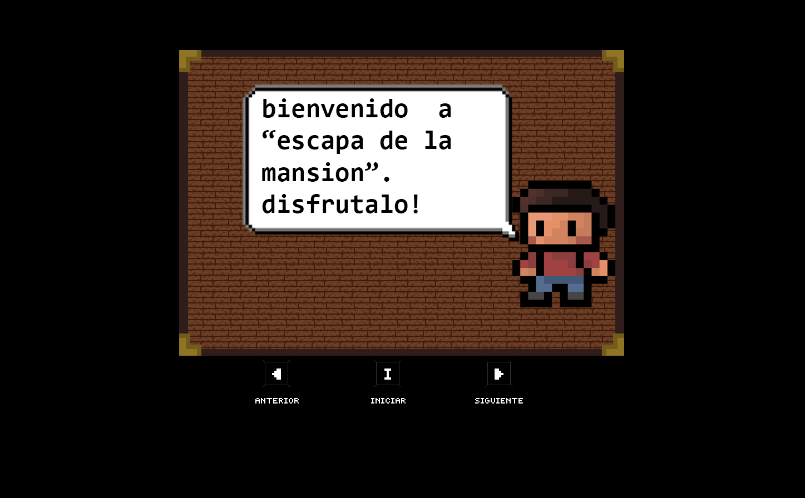
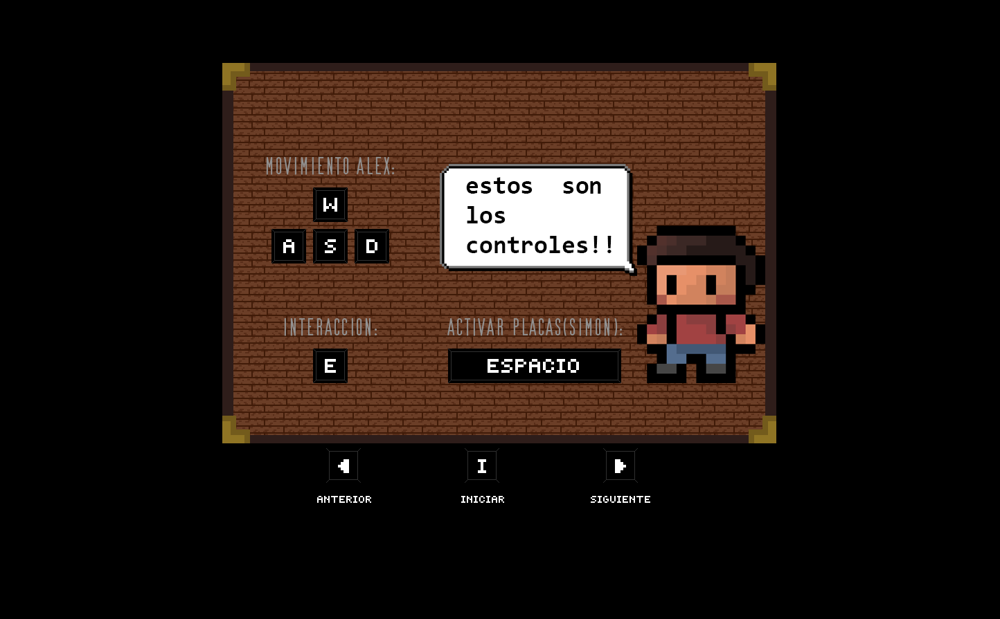
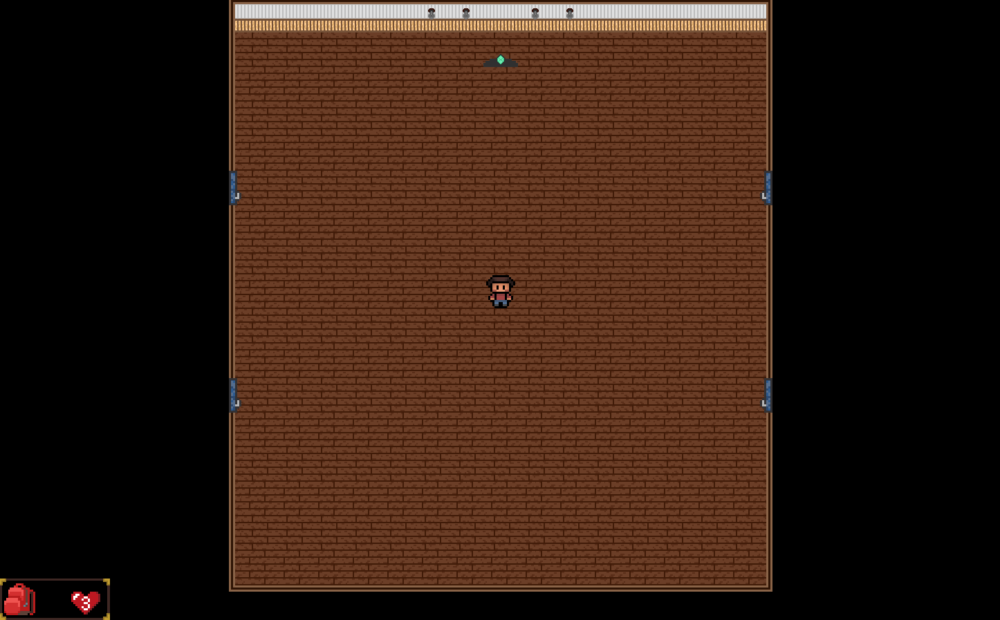
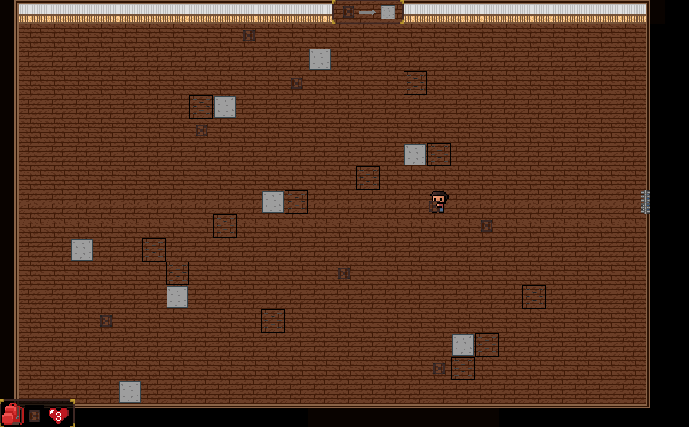
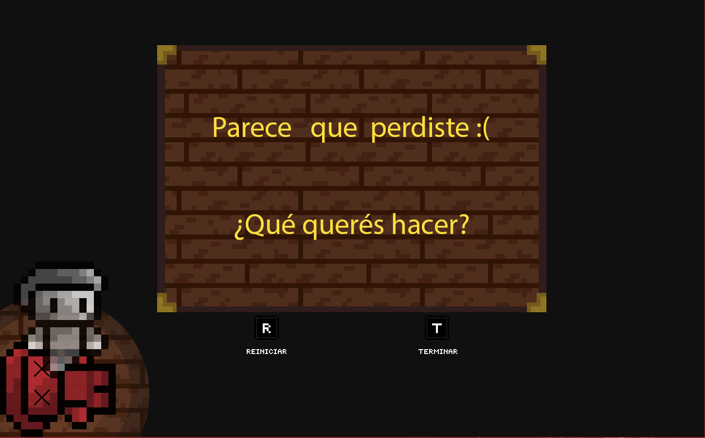
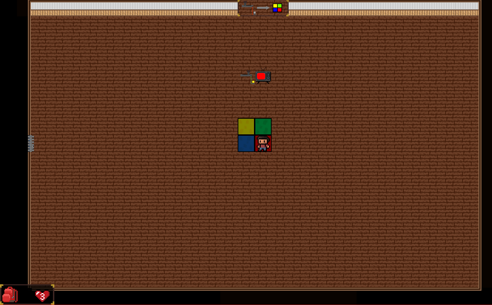
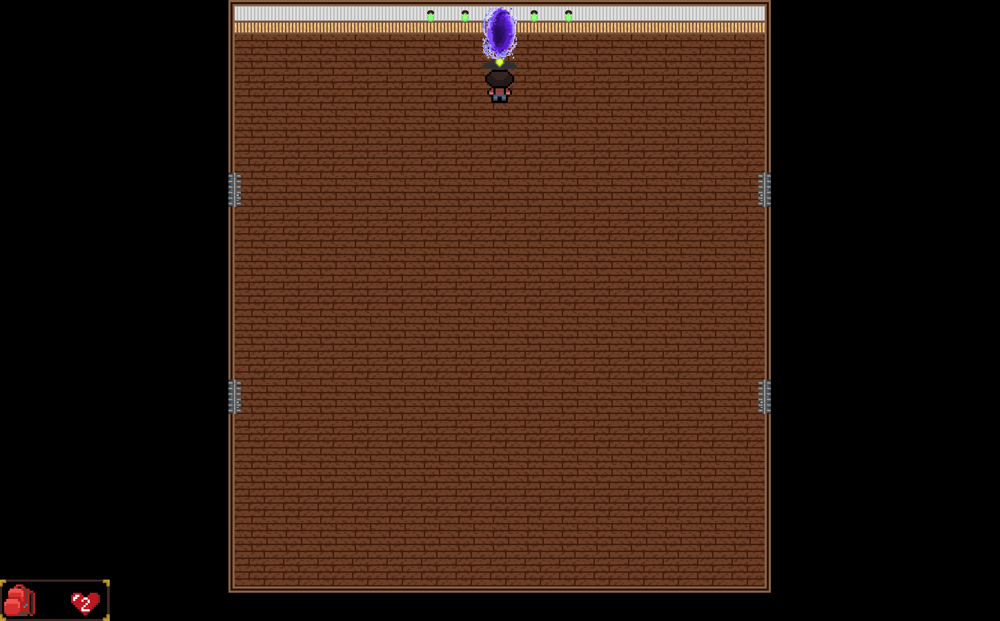

# Escapa de la mansión

## Equipo de desarrollo

- Palmier, Ignacio Nicolás
- Varela, Valentin Adriel
- Seco Gaitán, Facundo Nicolás.

## Capturas

## Reglas de Juego / Instrucciones
El jugador aparece en el pasillo de una mansión, no hay una salida a la vista, pero en el mismo hay cuatro misteriosas puertas que llevan a retos que se deben superar. 
Para poder escapar se debe ir completando cada minijuego y así desbloquear la salida de la mansión.
¡Mucho cuidado! El jugador solo cuenta con 3 vidas, cada vez que falla mientras intenta hacer un minijuego, este pierde una vida, al llegar a cero vidas el jugador muere y es GAME OVER.
Pero no todo está perdido, cada vez que se completa exitosamente un minijuego, el jugador gana una vida (como máximo total hasta tres vidas). 
Así que por favor ármate de valor y ayuda a nuestro amigo Alex a escapar de la mansión.

Movimiento:
- w - Adelante
- a - Izquierda
- s - Atras
- d - Derecha

Acciones:
- e - Interactuar con puertas, palancas, cajas y formas de rompecabeza
- espacio / barra espaciadora - Activar placa de Simon dice

Juego:
- i - Iniciar juego (solo durante la pantalla de inicio)
- r - Reintentar juego (durante la pantalla de muerte)
- t - Terminar juego (durante la pantalla de muerte)

## Otros

- Universidad Nacional de Hurlingham, UNAHUR.
- Versión de wollok - 3.0.0
- Una vez terminado, no tenemos problemas en que el repositorio sea público
