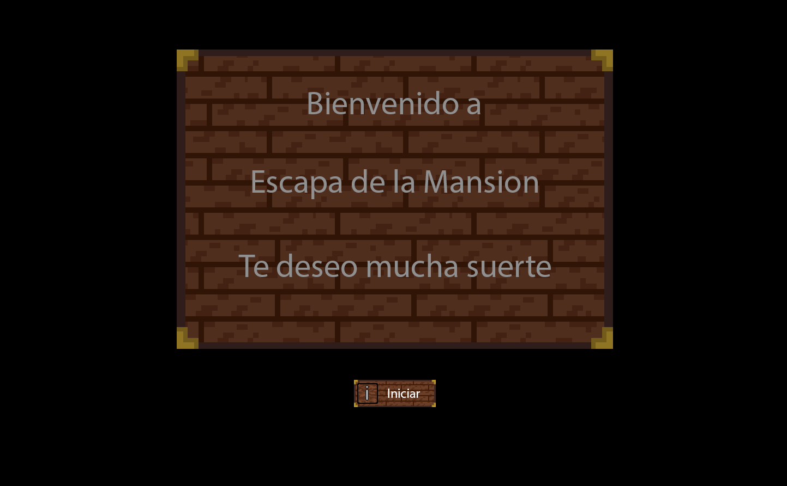
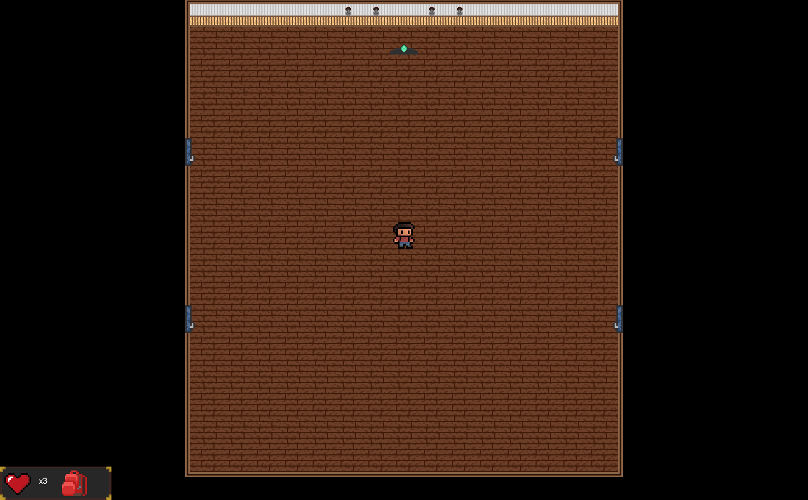
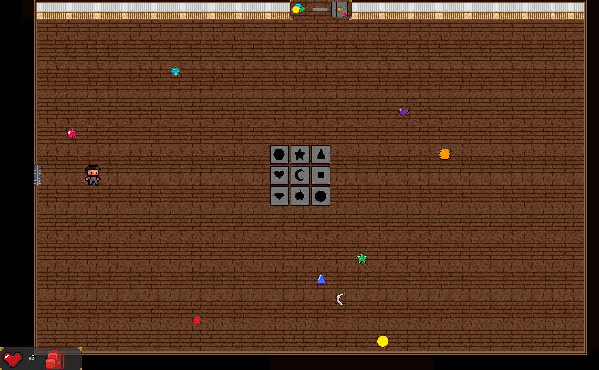
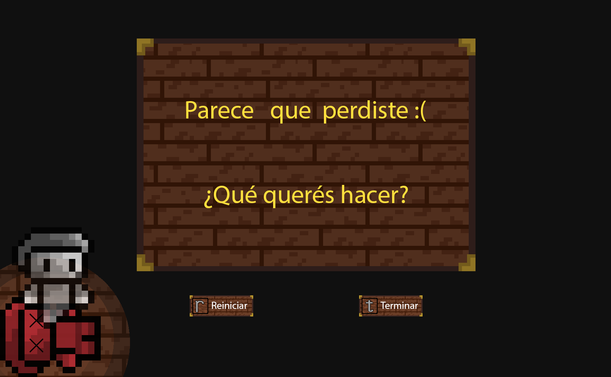
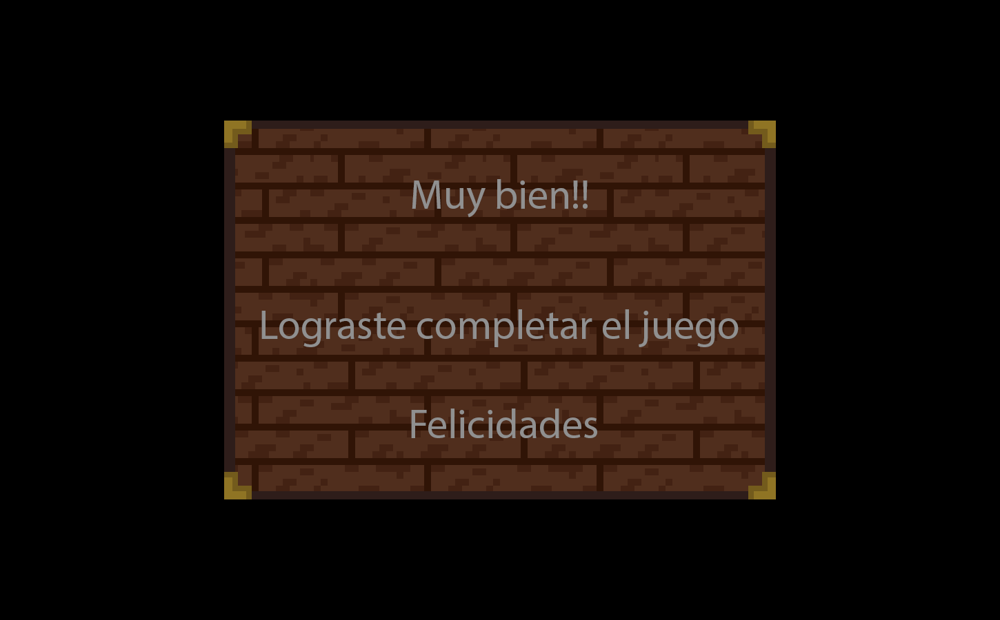

# Escapa de la mansión

## Equipo de desarrollo

- Palmier, Ignacio Nicolás
- Varela, Valentin Adriel
- Seco Gaitán, Facundo Nicolás.

## Capturas

## Reglas de Juego / Instrucciones

Movimiento:
    w - Adelante
    a - Izquierda
    s - Atras
    d - Derecha

Acciones:
    e - Interactuar con puertas, palancas, cajas y formas de rompecabeza
    espacio / barra espaciadora - Activar placa de Simon dice

Juego:
    i - Iniciar juego (solo durante la pantalla de inicio)
    r - Reintentar juego (durante la pantalla de muerte)
    t - Terminar juego (durante la pantalla de muerte)

## Otros

- Universidad Nacional de Hurlingham, UNAHUR.
- Versión de wollok - 3.0.0
- Una vez terminado, no tenemos problemas en que el repositorio sea público
